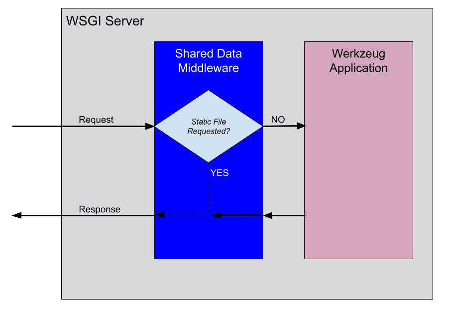
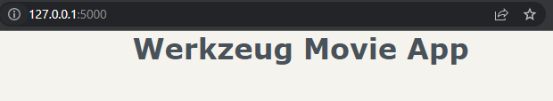
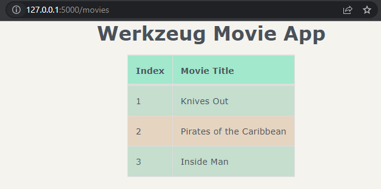
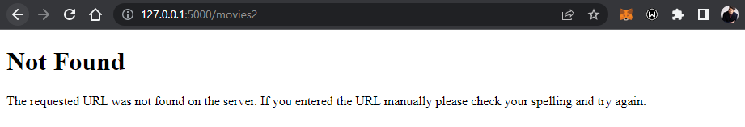
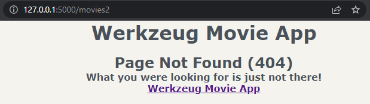

<div id="beginning"><h1>WERKZEUG</h1></div>

<b>Table Of Contents</b> |
------------ | 
[What is Werkzeug?](#intro)
[Hello World App](#helloworld)
[Middleware for Static Files](#mw-static)
[Templates](#templates)
[Routing](#routing)
[Exception Handling](#exception-handling)
[Request Processing](#request-processing)
[Form Processing](#form-processing)
[Why Flask Instead of Werkzeug?](#why-flask)

<div id="intro">
    <h2>Werkzeug</h2>
<p>Werkzeug is a collection of libraries that can be used to create a WSGI(Web Server Gateway Interface) compatible web application in Python
Werkzeug provides the following functionality (<i>which Flask uses)</i>:</p>
<ol>
    <li>Request processing</li>
    <li>Response handling</li>
    <li>URL Routing</li>
    <li>Middleware</li>
    <li>HTTP utilities</li>
    <li>Exception handling</li>
</ol>
<p>It also provides a basic development server with hot reloading.</p>
</div>

<div id="helloworld">
<h2>Hello World App</h2>
<p>Let's start by creating our simple "Hello World" app using the basic key functionality provided by Werkzeug. Let's start by creating a new project called "werkzeug_movie_app"</p>
<h3>Installation</h3>

```sh
$ mkdir werkzeug_movie_app
$ cd werkzeug_movie_app
$ python -m venv venv
$ source venv/Scripts/activate
# On Windows: venv\Scripts\activate
```
<p>
Install Werkzeug, Jinja2 and redis-py
</p>

```sh
(venv)$ pip install Werkzeug Jinja2 redis
(venv)$ pip freeze > requirements.txt
```
<p>
Redis will be used as the data storage solution for storing movie data.
</p>
<h3>Application</h3>
<p>Werkzeug is a collection of libraries used to build a WSGI-compatible web application. It doesn't provide a high-level class like Flask. Instead, we need to create the application from Werkzeug's libraries.

<p>
Let's create a new <a href="werkzeug_movie_app/app.py">app.py</a> file in the top-level folder of our project. The <u>MovieApp class</u> implements a WSGI-compatible web application, which processes requests from different users and generates responses back to the users. Here's the flow of how this class interfaces with a WSGI server:
</p>
<p align="center"></p>

<p>
When a request comes in, it's processed in <u>wsgi_app()</u>. The environment(<u>environ</u>) is automatically processed in the <u>Request</u> class of Werkzeug to create a <u>request</u> object. The request is then processed in <u>dispatch_request()</u>. In this example, dispatch_request() returns a response of "Hello World!". The response is then returned from wsgi_app().

<p>
<strong>Flask Comparison:</strong> Here MovieApp is actually a simplified version of the Flask class. Withing the Flask class, the wsgi_app() is the actualy WSGI application that interfaces with the WSGI server. Also, dispatch_request() and full_dispatch_request() are used to do the request dispatching, which matches the URL to the applicable view function and handles exceptions.
</p>

<h3>Development Server</h3>
Now we add the driver code to <i>app.py</i> to run the Werkzeug development server.

```py
if __name__ == "__main__":
    # Run the Werkzeug dev server to serve the WSGI app(MovieApp)
    from werkzeug.serving import run_simple
    app = create_app()
    run_simple('127.0.0.1', 5000, app, use_debugger=True, use_reloader=True)
```

<p>
After running the application and navigating to <a href="http://localhost:5000">http://localhost:5000</a>, we see the "Hello World!" message. Note that port number may vary. 
</p>
<p>
<strong>Flask Comparison:</strong> Within the Flask class, there's an equivalent run() method that utilizes the Werkzeug dev server.
</p>
</div>

<div id="mw-static">
    <h2>Middleware for Static Files</h2>
<p>
<strong>In web apps,middleware is a software component that can be added to the request/response processing pipeline to perform a specific function.</strong>
One important function for a web server/app to perform is serving static files(CSS, JS, image files). Werkzeug provides a middleware for this functionality called <u>SharedDataMiddleware</u>.

SharedDataMiddleware is ideally suited for working with the Werkzeug dev server to serve static files.

```
Note that for a production env, we'll need to switch out the Werkzeug dev server and SharedDataMiddleware for a web server such as Nginx and a WSGI server such as Gunicorn.
``` 

To utilize SharedDataMiddleware, we start by adding a new folder called "static" to the project with "css" and "img" folders, the tree now should look like this:
```sh
├── venv
├── app.py
├── requirements.txt
└── static
    ├── css
    └── img
```

Within the "static/img" folder, we add the Flask logo from <a href="../img/Flask.png">Flask/img/Flask.png</a>

Next, expand the app factory function and import the SharedDataMiddleware:
```py
import os
from werkzeug.middleware.shared_data import SharedDataMiddleware
```

```py
def create_app():
    app = MovieApp()
    app.wsgi_app = SharedDataMiddleware(app.wsgi_app, {
        '/static': os.path.join(os.path.dirname(__file__), 'static)
    })
    return app
```

Now, when a request is processed by the Werkzeug application(app), it will first be routed to SharedDataMiddleware to determine if a static file has been requested.

<p align="center"></p>

If a static file is requested, SharedDataMiddleware will generate the response with the static file. Otherwise, the request is passed down the chain to the Werkzeug app for processing in wsgi_app().

To see it in action, we run the server and navigate to <a href="http://localhost:5000/static/img/Flask.png">http://localhost:5000/static/img/Flask.png</a>

<strong>Flask Comparison: </strong> Flask doesn't utilize the SharedDataMiddleware. It takes a different approach for serving static files. By default, if a static folder exists, Flask automatically adds a new URL rule to serve static files up.

To illustrate this concept, we run `flask routes` in the top-level project of a Flask app. We'd see:

```sh
(venv)$ flask routes

Endpoint     Methods  Rule
-----------  -------  -----------------------
index        GET      /
static       GET      /static/<path:filename>
```
</p>

</div>

<div id="templates">
    <h2>Templates</h2>
<p>
We'll use Jinja for the templating engine as it is typically done in a Flask project. We start by adding a new folder called "templates":
</p>

```sh
├── venv
├── app.py
├── requirements.txt
├── static
│   ├── css
│   └── img
│       └── flask.png
└── templates
```


In order to utilize Jinja, we expand the constructor of the `MovieApp` class
```py
from jinja2 import Environment, FileSystemLoader
```

```py
def __init__(self):
    template_path = os.path.join(os.path.dirname(__file__), 'templates')
    self.jinja_env = Environment(loader=FileSystemLoader(template_path), autoescape = True)
```

<strong>Flask Comparison:</strong> Flask utilizes Jinja `Environment` as well to create the templating engine.

Within the `MovieApp` class, we add a new `render_template()` method:

```py
def render_template(self, template_name, **context):
    template = self.jinja_env.get_template(template_name)
    return Response(template.render(context), mimetype="text/html")
```

This method takes the `template_name` and any variables to pass to the templating engine(`context`). Then it generates a `Response` using the `render()` method from Jinja.

<strong>Flask Comparison:</strong> Flask has a familiar render_template() function.

To see `render_template()` in action, we need to update `dispatch_request()` to render a template:

```py
def dispatch_request(self, request):
    return self.render_template('base.html')
```

All requests to the app will now render the `templates/base.html` template.

Running the server and navigating to <a href="http://localhost:5000">http://localhost:5000</a>. We should now see:


</div>

<div id="routing">
    <h2>Routing</h2>

Routing means to match the URL to the appropriate view function. Werkzeug provides a `Map` class that allows us to match URLs to view functions using `Rule` objects.

Let's create the `Map` object in the `MovieApp` constructor to illustrate how this works:
```py
from werkzeug.routing import Map, Rule
```

```py
def __init__(self):
    template_path = os.path.join(os.path.dirname(__file__), 'templates')
    self.jinja_env = Environment(loader=FileSystemLoader(template_path),
                                 autoescape=True)
    
    self.url_map = Map([
        Rule('/'), endpoint='index'),
        Rule('/movies', endpoint='movies'),
    ])
```

Each `Rule` object defines a URL and the view function(`endpoint`) to call if the URL is matched:

```py
self.url_map = Map([
    Rule('/', endpoint='index'),
    Rule('/movies', endpoint='movies'),
])
```

For example, when the homepage ('/') is requested, the `ìndex` view function should be called.

<strong>Flask Comparison:</strong> One of the amazing features of Flask is the `@route` decorator. This decorator updates the `url_map` for the Flask app, similar to the hand-coded `url_map` that we defined above.

In order to utilize the URL mapping, `dispatch_request()` needs to be updated:

```py
from werkzeug.exceptions import HTTPException
```

```py
def dispatch_request(self, request):
    adapter = self.url_map.bind_to_environ(request.environ)
    try:
        endpoint, values = adapter.match()
        return getattr(self, endpoint)(request, **values)
    except HTTPException as e:
        return e
```

Now, when a request comes in to `dispatch_request()`, the `url_map` will be utilized to attempt to `match()` the URL to an entry. If the URL requested is included in the `url_map`, then the applicable view function (`endpoint`) will be called. If the URL is not found in the `url_map`, then an exception is raised.

We've specified two view functions in the `url_map`, so let's create them now within the `MovieApp` class:

```py
def index(self, request):
    return self.render_template('base.html')

def movies(self, request):
    return self.render_template('movies.html')
```

Now, if we run the server and navigate to '/', it should look the same. However, if we navigate to <a href="http://localhost:5000/movies">http://localhost:5000/movies</a>, we'll now see the table of movies styled with our `style.css`:

<p align="center"></p>

</div>

<div id="exception-handling">
    <h2>Exception Handling</h2>

Let's try navigating to <a href="http://localhost:5000/movies2">http://localhost:5000/movies2</a>.

What's expecting us is:


The page returned is the default error page when a URL is not found in `url_map`:

```py
def dispatch_request(self, request):
    adapter = self.url_map.bind_to_environ(request.environ)
    try:
        endpoint, values = adapter.match()
        return getattr(self, endpoint)(request, **values)
    except HTTPException as e:
        return e
```

Additionally, we see the following in the console:

```sh
127.0.0.1 - - [01/Jul/2022 16:50:54] "GET /movies2 HTTP/1.1" 404 -
```

Let's now create a custom error page by expanding `dispatch_request()`:

```py
from werkzeug.exceptions import HTTPException, NotFound
```

```py
def dispatch_request(self, request):
    adapter = self.url_map.bind_to_environ(request.environ)
    try:
        endpoint, values = adapter.match()
        return getattr(self, endpoint)(request, **values)
    except NotFound:
        return self.error_404()
    except HTTPException as e:
        return e
```

Now whenever a URL is not found in the `url_map`, it will be handled by calling `error_404()`:

```py
def error_404(self):
    response = self.render_template("404.html")
    response.status_code = 404
    return response
```

`error_404()` will call `render_template("404.html")`, so we should create and design `404.html` first:

```html



<div class="error-description">
    <h2>Page Not Found (404)</h2>
    <h4>What you were looking for is just not there!</h4>
    <h4><a href="/">Werkzeug Movie App</a></h4>
</div>

```

Now when we navigate to <a href="http://localhost:5000/movies2">http://localhost:5000/movies2</a>, we should see a friendly message:



<strong>Flask Comparison:</strong> When `full_dispatch_request()` in the `Flask` class detects an exception, it will be handled gracefully in `handle_user_exceptions()`. Flask allows custom error pages for all HTTP error codes as well.

</div>

<div id="request-processing">
    <h2>Request Processing</h2>

We'll add a form to the app to allow the user to input their favorite movies. As data storage, we'll be using `Redis`

<h3>Redis</h3>

As mentioned, we'll be using Redis, an in-memory data structure store, to persist the movies due to it's fast RW speed and ease of setup.

The quickest way to get Redis up and running is with Docker:

```sh
$ docker run --name some-redis-container -d -p 6379:6379 redis
```

To check that the Redis container is running:

```sh
$ docker ps
```

To stop the running Redis container:

```sh
$ docker stop some-redis # Name of our Docker container is "some-redis"
```

In order to utilize Redis, let's start by updating the `MovieApp` constructor to create an instance of `StrictRedis`:

```py
from redis import StrictRedis
```

```py
def __init__(self, config):
    template_path = os.path.join(os.path.dirname(__file__), 'templates')
    self.jinja_env = Environment(loader=FileSystemLoader(template_path), autoescape=True)

    self.url_map = Map([
        Rule('/', endpoint='index'),
        Rule('/movies', endpoint='movies'),
    ])

    self.redis = StrictRedis(config['redis_host'], config['redis_port'], decode_responses=True)
```

Note that the constructor (`__init__()`) has an additional argument `(config)`, which is used for creating the instance of `StrictRedis`.

The configuration parameters that are passed in to the constructor need to be specified in the application factory function:

```py
def create_app():
    app = MovieApp{'redis_host': 'localhost', 'redis_port': 6379}
    app.wsgi_app = SharedDataMiddleware(app.wsgi_app, {
        '/static': os.path.join(os.path.dirname(__file__), 'static')
    })
    return app
```


</div>

<div id="form-processing">
    <h2>Form Processing</h2>
</div>

<div id="why-flask">
    <h2>Why Flask instead of Werkzeug?</h2>
</div>