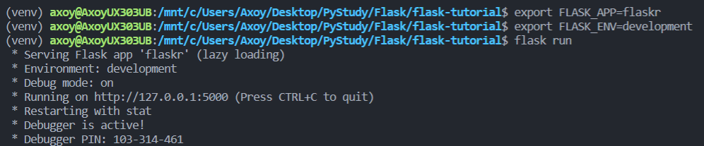
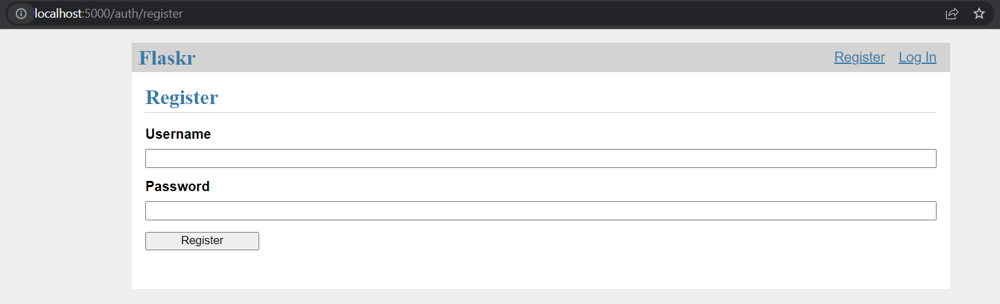
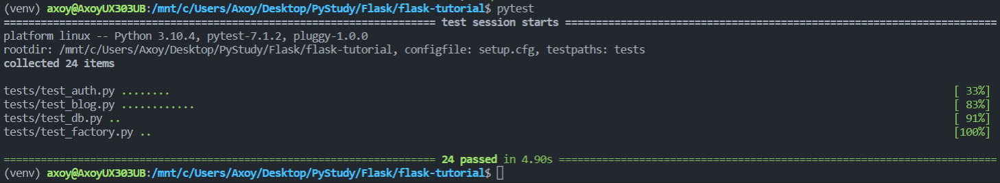
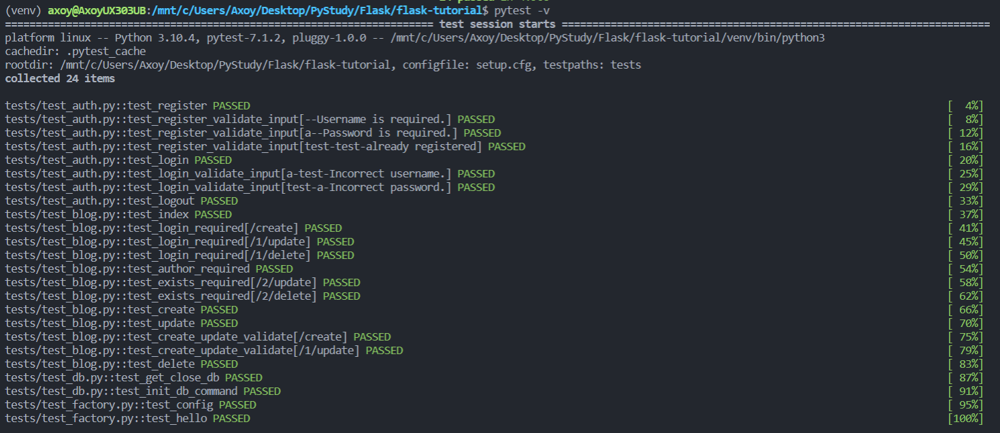
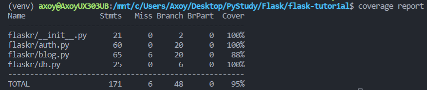

<div id="beginning"><h1>Tutorial</h1></div>

<b>Table Of Contents</b> |
------------ | 
[Project Layout](#project-layout)
[Application Factory](#app-factory)
[Database Access](#db-access)
[Views and Blueprints](#views)
[Templates](#templates)
[Static Files](#statics)
[Making the Project Installable](#install)
[Test Coverage](#tests)
[Deploy to Production](#deploy)

<div id="project-layout"></div>
    <h2>Project Layout</h2>

As a project gets bigger, it becomes a need to keep the code in separate files. Python projects use packages to organize code into multiple modules that can be imported where needed.

The project directory will contain:

- `flaskr/`, a Python package containing our app code and files
- `tests/`, a directory containing test modules
- `venv/`, a Python virtual environment where Flask and other dependencies are installed.  
- Installation files, telling Python how to install the project in another machine.

By the end, our project will look like:

```
/flask-tutorial
├── flaskr/
│   ├── __init__.py
│   ├── db.py
│   ├── schema.sql
│   ├── auth.py
│   ├── blog.py
│   ├── templates/
│   │   ├── base.html
│   │   ├── auth/
│   │   │   ├── login.html
│   │   │   └── register.html
│   │   └── blog/
│   │       ├── create.html
│   │       ├── index.html
│   │       └── update.html
│   └── static/
│       └── style.css
├── tests/
│   ├── conftest.py
│   ├── data.sql
│   ├── test_factory.py
│   ├── test_db.py
│   ├── test_auth.py
│   └── test_blog.py
├── venv/
├── setup.py
└── MANIFEST.in
```

</div>

<div id="app-factory">
    <h2>Application Factory</h2>

A Flask application is an instance of the Flask class. Everything about the application, such as configuration and URLs, will be registered with this class.

The most straightforward way to create a Flask application is to create a global Flask instance directly at the top of your code. While this is simple and useful in some cases, it can cause some tricky issues as the project grows.

Instead of creating a Flask instance globally, we will create it inside a function. This function is known as the application factory. Any configuration, registration, and other setup the application needs will happen inside the function, then the application will be returned.

<h3>The Application Factory</h3>

Let's create the `flaskr` dir and add the `__init__.py` file. The `__init__.py` serves double duty: it will contain the application factory, and it tells Python that the `flaskr` directory should be treated as a package.

```sh
$ mkdir flaskr
```

`flaskr/__init__.py :`
```py
import os
from flask import Flask

def create_app(test_config=None):
    # create and configure the app
    app = Flask(__name__, instance_relative_config=True)
    app.config.from_mapping(
        SECRET_KEY='dev',
        DATABASE=os.path.join(app.instance_path, 'flaskr.sqlite'),
    )

    if test_config is None:
        # load the instance config, if it exists, when not testing
        app.config.from_pyfile('config.py', silent=True)
    else:
        # load the test config if passed in
        app.config.from_mapping(test_config)

    # ensure the instance folder exists
    try:
        os.makedirs(app.instance_path)
    except OSError:
        pass

    # a simple page that says hello
    @app.route('/hello')
    def hello():
        return 'Hello, World!'

    return app
```

`create_app()` is the application factory function. 

1. `app = Flask(__name__, instance_relative_config=True)` creates the Flask instance.

   - `__name__` is the name of the current Python module. The app needs to know where it’s located to set up some paths, and `__name__` is a convenient way to tell it that.

    - `instance_relative_config=True` tells the app that configuration files are relative to the instance folder. The instance folder is located outside the flaskr package and can hold local data that shouldn’t be committed to version control, such as configuration secrets and the database file.

2. `app.config.from_mapping()` sets some default configuration that the app will use:

    - `SECRET_KEY` is used by Flask and extensions to keep data safe. It’s set to **'dev'** to provide a convenient value during development, but it should be overridden with a random value when deploying.

    - `DATABASE` is the path where the SQLite database file will be saved. It’s under **app.instance_path**, which is the path that Flask has chosen for the instance folder. You’ll learn more about the database in the next section.

3. `app.config.from_pyfile()` overrides the default configuration with values taken from the `config.py` file in the instance folder if it exists. For example, when deploying, this can be used to set a real **SECRET_KEY**.

    - `test_config` can also be passed to the factory, and will be used instead of the instance configuration. This is so the tests you’ll write later in the tutorial can be configured independently of any development values you have configured.

4. `os.makedirs()` ensures that app.instance_path exists. Flask doesn’t create the instance folder automatically, but it needs to be created because our project will create the SQLite database file there.

5. `@app.route()` creates a simple route so you can see the application working before getting into the rest of the tutorial. It creates a connection between the URL **/hello** and a function that returns a response, the string **'Hello, World!'** in this case.

<h3>Running the Application</h3>

Now we can run our app using the `flask` command. From the terminal, we tell Flask where to find our app, then run it in dev mode. While doing this, we should still be in the top-level `flask-tutorial` dir, not the `flaskr` package.

Dev mode shows an interactive debugger when whenever a page raises an exception, and restarts the server whenever you make changes to the code. We can leave it running and just reload the browser page after we make changes in our app as Flask has the hot-reloading feature.

```sh
$ export FLASK_APP=flaskr
$ export FLASK_ENV=development
$ flask run
``` 

We should see an output similar to this:


Also, <a href="http://localhost:5000/hello">http://localhost:5000/hello</a> should show us the 'Hello, World!' output.

**Note:** If another program is already using port 5000, you'll see **OSError: [Errno 98] or OSError: [WinError 10013]** when the server tries to start.

</div>

<div id="db-access">
    <h2>Database Access</h2>

The app will use a `SQLite` DB to store users and posts. Python comes in with built-in support for SQLite in `sqlite3` module.

SQLite is convenient because it doesn’t require setting up a separate database server and is built-in to Python. However, if concurrent requests try to write to the database at the same time, they will slow down as each write happens sequentially. Small applications won’t notice this. Once you become big, you may want to switch to a different database.

<h2>Connecting to the DB</h2>

The first thing to do when working with a SQLite database (and most other Python database libraries) is to create a connection to it. Any queries and operations are performed using the connection, which is closed after the work is finished.

In web applications this connection is typically tied to the request. It is created at some point when handling a request, and closed before the response is sent.

`flaskr/db.py`

```py
import sqlite3

import click
from flask import current_app, g
from flask.cli import with_appcontext


def get_db():
    if 'db' not in g:
        g.db = sqlite3.connect(
            current_app.config['DATABASE'],
            detect_types=sqlite3.PARSE_DECLTYPES
        )
        g.db.row_factory = sqlite3.Row

    return g.db


def close_db(e=None):
    db = g.pop('db', None)

    if db is not None:
        db.close()
```

**g** is a special object that is unique for each request. It is used to store data that might be accessed by multiple functions during the request. The connection is stored and reused instead of creating a new connection if `get_db()` is called a second time in the same request.

`current_app` is another special object that points to the Flask application handling the request. Since we used an application factory, there is no application object when writing the rest of your code. `get_db()` will be called when the application has been created and is handling a request, so **current_app** can be used.

`sqlite3.connect()` establishes a connection to the file pointed at by the DATABASE configuration key. This file doesn’t have to exist yet, and won’t until you initialize the database later.

`sqlite3.Row` tells the connection to return rows that behave like dicts. This allows accessing the columns by name.

`close_db()` checks if a connection was created by checking if g.db was set. If the connection exists, it is closed. Further down we will tell the application about the `close_db()` function in the application factory so that it is called after each request.

<h3>Creating the Tables</h3>

In `SQLite`, data is stored in tables and columns. These need to be created before you can store and retrieve data. Flaskr will store users in the **user** table, and posts in the **post** table. Create a file with the SQL commands needed to create empty tables:

`flaskr/schema.sql:`
```sql
DROP TABLE IF EXISTS user;
DROP TABLE IF EXISTS post;

CREATE TABLE user (
  id INTEGER PRIMARY KEY AUTOINCREMENT,
  username TEXT UNIQUE NOT NULL,
  password TEXT NOT NULL
);

CREATE TABLE post (
  id INTEGER PRIMARY KEY AUTOINCREMENT,
  author_id INTEGER NOT NULL,
  created TIMESTAMP NOT NULL DEFAULT CURRENT_TIMESTAMP,
  title TEXT NOT NULL,
  body TEXT NOT NULL,
  FOREIGN KEY (author_id) REFERENCES user (id)
);
```

Let's add the Python functions that will run these SQL commands to the db.py file:

```py
def init_db():
    db = get_db()

    with current_app.open_resource('schema.sql') as f:
        db.executescript(f.read().decode('utf8'))


@click.command('init-db')
@with_appcontext
def init_db_command():
    """Clear the existing data and create new tables."""
    init_db()
    click.echo('Initialized the database.')
```

`open_resource()` opens a file relative to the flaskr package, which is useful since you we don't need to know where that location is when deploying the application later. `get_db()` returns a database connection, which is used to execute the commands read from the file.

`click.command()` defines a command line command called **init-db** that calls the init_db function and shows a success message to the user.

The `close_db()` and `init_db_command()` functions need to be registered with the application instance; otherwise, they won’t be used by the application. However, since we’re using a factory function, that instance isn’t available when writing the functions. Instead, let's write a function in `db.py` that takes an application and does the registration.

```py
def init_app(app):
    app.teardown_appcontext(close_db)
    app.cli.add_command(init_db_command)
```

`app.teardown_appcontext()` tells Flask to call that function when cleaning up after returning the response.

`app.cli.add_command()` adds a new command that can be called with the flask command.

Now let's import and call this function from the factory and then, place the new code at the end of the factory function before returning the app.

```py
def create_app():
    app = ...
    # existing code omitted

    from . import db
    db.init_app(app)

    return app
```

<h3>Initializing the DB File</h3>

Now that `init-db` has been registered with the app, it can be called using the flask command, similar to the run command.

```sh
$ flask init-db
Initialized the database.
```

There should now appear a flaskr.sqlite file in the instance folder in your project.

</div>

<div id="views">
    <h2>Views and Blueprints</h2>

A view function is the code to respond to requests. Flask uses patterns to match the incoming request URL to the view that should handle it. The view returns data that Flask turns into an outgoing response. Flask can also go the other direction and generate a URL to a view based on its name and arguments.

<h3>Creating a Blueprint</h3>

A **Blueprint** is a way to organize a group of related views and other code. Rather than registering views and other code directly with an application, they are registered with a blueprint. Then the blueprint is registered with the application when it is available in the factory function.

in `flaskr/auth.py`:

```py
import functools

from flask import Blueprint, flash, g, redirect, render_template, request, session, url_for
from werkzeug.security import check_password_hash, generate_password_hash

from flaskr.db import get_db

bp = Blueprint('auth', __name__, url_prefix = "/auth")
```

This creates a **Blueprint** named `'auth'`. Like the application object, the blueprint needs to know where it’s defined, so `__name__` is passed as the second argument. The `url_prefix` will be prepended to all the URLs associated with the blueprint.

Let's import and register the blueprint from the factory using app.register_blueprint() in `__init__.py` and place the new code at the end of the factory function before returning the app.

```py
def create_app():
    app = ...
    # existing code omitted

    from . import auth
    app.register_blueprint(auth.bp)

    return app
``` 

The authentication blueprint will have views to register new users and to log in and log out.

<h3>Register View</h3>

When the user visits the `/auth/register` URL, the register view will return HTML with a form for them to fill out. When they submit the form, it will validate their input and either show the form again with an error message or create the new user and go to the login page.

in `auth.py`:

```py
@bp.route('/register', methods=('GET', 'POST'))
def register():
    if request.method == 'POST':
        username = request.form['username']
        password = request.form['password']
        db = get_db()
        error = None

        if not username:
            error = 'Username is required.'
        elif not password:
            error = 'Password is required.'

        if error is None:
            try:
                db.execute(
                    "INSERT INTO user (username, password) VALUES (?, ?)",
                    (username, generate_password_hash(password)),
                )
                db.commit()
            except db.IntegrityError:
                error = f"User {username} is already registered."
            else:
                return redirect(url_for("auth.login"))

        flash(error)

    return render_template('auth/register.html')
```

Here’s what the register view function is doing:

1. `@bp.route` associates the URL `/register` with the `register()` view function. When Flask receives a request to `/auth/register`, it will call the register view and use the return value as the response.

2. If the user submitted the form, `request.method` will be **'POST'**. In this case, start validating the input.

3. `request.form` is a special type of dict mapping submitted form keys and values. The user will input their **username** and **password**.

4. Validate that **username** and **password** are not empty.

5. If validation succeeds, insert the new user data into the database.

    - **db.execute** takes a SQL query with `?` placeholders for any user input, and a tuple of values to replace the placeholders with. The database library will take care of escaping the values so you are not vulnerable to a *SQL injection attack*.

    - For security, passwords should never be stored in the database directly. Instead, `generate_password_hash()` is used to securely hash the password, and that hash is stored. Since this query modifies data,` db.commit()` needs to be called afterwards to save the changes.

    - An `sqlite3.IntegrityError` will occur if the username already exists, which should be shown to the user as another validation error.

6. After storing the user, they are redirected to the login page. `url_for()` generates the URL for the login view based on its name. This is preferable to writing the URL directly as it allows you to change the URL later without changing all code that links to it. `redirect()` generates a redirect response to the generated URL.

7. If validation fails, the error is shown to the user. `flash()` stores messages that can be retrieved when rendering the template.

8. When the user initially navigates to `auth/register`, or there was a validation error, an HTML page with the registration form should be shown. `render_template()` will render a template containing the HTML, which we'll write in a moment.


<h3>Login View</h3>

This view follows the same pattern as the register view.

```py
@bp.route('/login', methods=('GET', 'POST'))
def login():
    if request.method == 'POST':
        username = request.form['username']
        password = request.form['password']
        db = get_db()
        error = None
        user = db.execute(
            'SELECT * FROM user WHERE username = ?', (username,)
        ).fetchone()

        if user is None:
            error = 'Incorrect username.'
        elif not check_password_hash(user['password'], password):
            error = 'Incorrect password.'

        if error is None:
            session.clear()
            session['user_id'] = user['id']
            return redirect(url_for('index'))

        flash(error)

    return render_template('auth/login.html')
```

There are a few differences from the register view:

1. The user is queried first and stored in a variable for later use.

    - `fetchone()` returns one row from the query. If the query returned no results, it returns None. Later, `fetchall()` will be used, which returns a list of all results.

2. `check_password_hash()` hashes the submitted password in the same way as the stored hash and securely compares them. If they match, the password is valid.

3. `session` is a **dict** that stores data across requests. When validation succeeds, the user’s id is stored in a new session. The data is stored in a cookie that is sent to the browser, and the browser then sends it back with subsequent requests. Flask securely signs the data so that it can’t be tampered with.

Now that the user’s id is stored in the session, it will be available on subsequent requests. At the beginning of each request, if a user is logged in their information should be loaded and made available to other views.

```py
@bp.before_app_request
def load_logged_in_user():
    user_id = session.get('user_id')

    if user_id is None:
        g.user = None
    else:
        g.user = get_db().execute(
            'SELECT * FROM user WHERE id = ?', (user_id,)
        ).fetchone()
```

`bp.before_app_request()` registers a function that runs before the view function, no matter what URL is requested. `load_logged_in_user()` checks if a user id is stored in the session and gets that user’s data from the database, storing it on `g.user`, which lasts for the length of the request. If there is no user id, or if the id doesn’t exist, g.user will be None.


<h3>Logout View</h3>

To log out, we need to remove the user id from the session. Then `load_logged_in_user()` won’t load a user on subsequent requests.

```py
@bp.route('/logout')
def logout():
    session.clear()
    return redirect(url_for('index'))
```

<h3>Requiring Authentication in Other Views</h3>

Creating, editing, and deleting blog posts will require a user to be logged in. A *decorator* can be used to check this for each view it’s applied to.

in `flaskr/auth.py`:

```py
def login_required(view):
    @functools.wraps(view)
    def wrapped_view(**kwargs):
        if g.user is None:
            return redirect(url_for('auth.login'))

        return view(**kwargs)
    return wrapped_view
```

This decorator returns a new view function that wraps the original view it’s applied to. The new function checks if a user is loaded and redirects to the login page otherwise. If a user is loaded the original view is called and continues normally. We’ll use this decorator when writing the blog views.

<h3>Endpoints and URLs</h3>

The `url_for()` function generates the URL to a view based on a name and arguments. The name associated with a view is also called the endpoint, and by default it’s the same as the name of the view function.

When using a blueprint, the name of the blueprint is prepended to the name of the function, so the endpoint for the login function we wrote above is `'auth.login'` because we added it to the `'auth'` blueprint.

<div id="blog">
    <h3>Blog Blueprint</h3>

The blog should list all posts, allow logged in users to create posts, and allow the author of a post to edit or delete it.

Inside `flaskr/blog.py`:

```py
from flask import (
    Blueprint, flash, g, redirect, render_template, request, url_for
)
from werkzeug.exceptions import abort

from flaskr.auth import login_required
from flaskr.db import get_db

bp = Blueprint('blog', __name__)
```

Inside `flaskr/__init__.py`:

```py
def create_app():
    app = ...
    # existing code omitted

    from . import blog
    app.register_blueprint(blog.bp)
    app.add_url_rule('/', endpoint='index')

    return app
```

Unlike the auth blueprint, the blog blueprint does not have a `url_prefix`. So the index view will be at /, the create view at /create, and so on. The blog is the main feature of Flaskr, so it makes sense that the blog index will be the main index.

However, the endpoint for the index view defined below will be `blog.index`. Some of the authentication views referred to a plain index endpoint. `app.add_url_rule()` associates the endpoint name 'index' with the `/` url so that `url_for('index')` or `url_for('blog.index')` will both work, generating the same `/` URL either way.

<h3>Index</h3>

The index will show all of the posts, most recent first. A `JOIN` is used so that the author information from the `user` table is available in the result.

Inside `flaskr/blog.py`:

```py
@bp.route('/')
def index():
    db = get_db()
    posts = db.execute(
        'SELECT p.id, title, body, created, author_id, username'
        ' FROM post p JOIN user u ON p.author_id = u.id'
        ' ORDER BY created DESC'
    ).fetchall()
    return render_template('blog/index.html', posts=posts)
```

See <a href="templates/blog/index.html">`flaskr/templates/blog/index.html`</a> for index layout of our project.

When a user is logged in, the **header** block adds a link to the `create` view. When the user is the author of a post, they’ll see an “Edit” link to the `update` view for that post. `loop.last` is a special variable available inside Jinja for loops. It's used to determine if the current iteration is the last one in the loop.

<h3>Create</h3>

The create view will allow the user to create a new post.

The login_required decorator we wrote earlier is used on the blog views. A user must be logged in to visit these views, otherwise they will be redirected to the login page.

Inside `flaskr/blog.py` we add:

```py
@bp.route('/create', methods=('GET', 'POST'))
@login_required
def create():
    if request.method == 'POST':
        title = request.form['title']
        body = request.form['body']
        error = None

        if not title:
            error = 'Title is required.'

        if error is not None:
            flash(error)
        else:
            db = get_db()
            db.execute(
                'INSERT INTO post (title, body, author_id)'
                ' VALUES (?, ?, ?)',
                (title, body, g.user['id'])
            )
            db.commit()
            return redirect(url_for('blog.index'))

    return render_template('blog/create.html')
```

See <a href="flaskr/templates/blog/create.html">flaskr/templates/blog/create.html</a> for the layout of the create view.

<h3>Update</h3>

Both the `update` and `delete` views will need to fetch a **post** by **id** and check if the author matches the logged in user. To avoid duplicating code, we can write a function to get the post and call it from each view.

Inside `flaskr/blog.py`

```py
def get_post(id, check_author=True):
    post = get_db().execute(
        'SELECT p.id, title, body, created, author_id, username'
        ' FROM post p JOIN user u ON p.author_id = u.id'
        ' WHERE p.id = ?',
        (id,)
    ).fetchone()

    if post is None:
        abort(404, f"Post id {id} doesn't exist.")

    if check_author and post['author_id'] != g.user['id']:
        abort(403)

    return post
```

**abort()** will raise a special exception that returns an HTTP status code. It takes an optional message to show with the error, otherwise a default message is used. **404** means **“Not Found”**, and **403** means **“Forbidden”**. (**401** means **“Unauthorized”**, but we redirect to the login page instead of returning that status.)

The `check_author` argument is defined so that the function can be used to get a post without checking the author. This would be useful if we wrote a view to show an individual post on a page, where the user doesn’t matter because they’re not modifying the post.

Inside `flaskr/blog.py`

```py
@bp.route('/<int:id>/update', methods=('GET', 'POST'))
@login_required
def update(id):
    post = get_post(id)

    if request.method == 'POST':
        title = request.form['title']
        body = request.form['body']
        error = None

        if not title:
            error = 'Title is required.'

        if error is not None:
            flash(error)
        else:
            db = get_db()
            db.execute(
                'UPDATE post SET title = ?, body = ?'
                ' WHERE id = ?',
                (title, body, id)
            )
            db.commit()
            return redirect(url_for('blog.index'))

    return render_template('blog/update.html', post=post)
```

Unlike the views we’ve written so far, the `update()` function takes an argument, `id`. That corresponds to the `<int:id>` in the route. A real URL will look like **/1/update**. Flask will capture the 1, ensure it’s an int, and pass it as the id argument. If we don’t specify int: and instead do <id>, it will be a string. To generate a URL to the update page, `url_for()` needs to be passed the id so it knows what to fill in: `url_for('blog.update', id=post['id'])`. This is also in the index.html file.

The `create` and `update` views look very similar. The main difference is that the `update` view uses a **post** object and an `UPDATE` query instead of an `INSERT`. With some clever refactoring, we could also use one view and template for both actions.

See the template for the update view on <a href="flaskr/templates/blog/update.html">flaskr/templates/blog/update.html</a>.

The `update` template has two forms. The first posts the edited data to the current page (`/<id>/update`). The other form contains only a button and specifies an action attribute that posts to the delete view instead. The button uses some JavaScript to show a confirmation dialog before submitting.

The pattern `{{ request.form['title'] or post['title'] }}` is used to choose what data appears in the form. When the form hasn’t been submitted, the original post data appears, but if invalid form data was posted you want to display that so the user can fix the error, so `request.form` is used instead. request is another variable that’s automatically available in templates.

<h3>DELETE</h3>

The `delete` view doesn’t have its own template, the delete button is part of `update.html` and posts to the `/<id>/delete` URL. Since there is no template, it will only handle the POST method and then redirect to the index view.

Inside `flaskr/blog.py`

```py
@bp.route('/<int:id>/delete', methods=('POST',))
@login_required
def delete(id):
    get_post(id)
    db = get_db()
    db.execute('DELETE FROM post WHERE id = ?', (id,))
    db.commit()
    return redirect(url_for('blog.index'))
```


</div>

<div id="templates">
    <h2>Templates</h2>

The template files will be stored in the `templates directory` inside the flaskr package.

Templates are files that contain static data as well as placeholders for dynamic data. A template is rendered with specific data to produce a final document. Flask uses the `Jinja` template library to render templates.

In our application, we will use templates to render HTML which will display in the user’s browser. **In Flask, Jinja is configured to autoescape any data that is rendered in HTML templates.** This means that it’s safe to render user input; any characters they’ve entered that could mess with the HTML, such as `<` and `>` will be escaped with safe values that look the same in the browser but don’t cause unwanted effects.

Jinja looks and behaves mostly like Python. Special delimiters are used to distinguish Jinja syntax from the static data in the template. **Anything between {{ and }} is an expression that will be output to the final document.  denotes a control flow statement like if and for.** Unlike Python, blocks are denoted by start and end tags rather than indentation since static text within a block could change indentation.

<h3>The Base Layout</h3>

Each page in the application will have the same basic layout around a different body. Instead of writing the entire HTML structure in each template, each template will **extend** a base template and override specific sections.

in `flaskr/templates/base.html`:

```html
<!doctype html>
<title> - Flaskr</title>
<link rel="stylesheet" href="{{ url_for('static', filename='style.css') }}">
<nav>
  <h1>Flaskr</h1>
  <ul>
    
      <li><span>{{ g.user['username'] }}</span>
      <li><a href="{{ url_for('auth.logout') }}">Log Out</a>
    
      <li><a href="{{ url_for('auth.register') }}">Register</a>
      <li><a href="{{ url_for('auth.login') }}">Log In</a>
    
  </ul>
</nav>
<section class="content">
  <header>
    
  </header>
  
    <div class="flash">{{ message }}</div>
  
  
</section>
```

**g** is automatically available in templates. Based on if **g.user** is set (from `load_logged_in_user()`), either the username and a log out link are displayed, or links to register and log in are displayed. `url_for()` is also automatically available, and is used to generate URLs to views instead of writing them out manually.

After the page title, and before the content, the template loops over each message returned by `get_flashed_messages()`. We used `flash()` in the views to show error messages, and this is the code that will display them.

There are three blocks defined here that will be overridden in the other templates:

1. `` will change the title displayed in the browser’s tab and window title.

2. `` is similar to title but will change the title displayed on the page.

3. `` is where the content of each page goes, such as the login form or a blog post.

The base template is directly in the `templates` directory. To keep the others organized, the templates for a blueprint will be placed in a directory with the same name as the blueprint.

<h3>Register Layout</h3>

in `flaskr/templates/auth/register.html`:
```html



  <h1>Register</h1>



  <form method="post">
    <label for="username">Username</label>
    <input name="username" id="username" required>
    <label for="password">Password</label>
    <input type="password" name="password" id="password" required>
    <input type="submit" value="Register">
  </form>

```

`` tells Jinja that this template should replace the blocks from the base template. All the rendered content must appear inside `` tags that override blocks from the base template.

A useful pattern used here is to place `` inside ``. This will set the title block and then output the value of it into the header block, so that both the window and page share the same title without writing it twice.

The `input` tags are using the `required` attribute here. This tells the browser not to submit the form until those fields are filled in. If the user is using an older browser that doesn’t support that attribute, or if they are using something besides a browser to make requests, we still want to validate the data in the Flask view. It’s important to always fully validate the data on the server, even if the client does some validation as well.

<h3>Log In Layout</h3>

This is identical to the register template except for the title and submit button.

Inside `flaskr/templates/auth/login.html`: 

```html



  <h1>Log In</h1>



  <form method="post">
    <label for="username">Username</label>
    <input name="username" id="username" required>
    <label for="password">Password</label>
    <input type="password" name="password" id="password" required>
    <input type="submit" value="Log In">
  </form>

```

<h3>Registering a User</h3>

Now that the authentication templates are written, we can register a user by going to <a href="http://127.0.0.1:5000/auth/register">http://127.0.0.1:5000/auth/register</a>.


</div>

<div id="statics">
    <h2>Static Files</h2>

CSS can be added to add style to the HTML layout we constructed. The style won’t change, so it’s a static file rather than a template.

Flask automatically adds a static view that takes a path relative to the `flaskr/static` directory and serves it. The base.html template already has a link to the style.css file:
`{{ url_for('static', filename='style.css') }}`

Besides CSS, other types of static files might be files with JavaScript functions, or a logo image. They are all placed under the `flaskr/static` directory and referenced with `url_for('static', filename='...')`.

<a href="static/style.css">Check the styling in `flaskr/static/style.css`.</a>

After styling, the page should look like:


</div>

<div id="install">
    <h2>Making the Project Installable</h2>
</div>

- Currently, Python and Flask understand how to use the flaskr package only because you’re running from your project’s directory. Installing means you can import it no matter where you run from.

- You can manage your project’s dependencies just like other packages do, so pip install yourproject.whl installs them.

- Test tools can isolate your test environment from your development environment.

<h3>Describe the Project</h3>

setup.py is a file that contains the code that installs the project. It describes the project’s dependencies and how to install them.

```py
from setuptools import setup

setup(
    name='flaskr',
    version='1.0.0',
    packages=find_packages(),
    include_package_data=True,
    zip_safe=False,
    install_requires=[
        'flask',
    ],
)
```

`packages` tells Python what package directories (and the Python files they contain) to include. `find_packages()` finds these directories automatically so you don’t have to type them out. To include other files, such as the static and templates directories, `include_package_data` is set. Python needs another file named **MANIFEST.in** to tell what this other data is.

`MANIFEST.in` contains a line that tells Python to include the static and templates directories.

```in
include flaskr/schema.sql
graft flaskr/static
graft flaskr/templates
global-exclude *.pyc
```

This tells Python to copy everything in the static and templates directories, and the `schema.sql` file, but to exclude all bytecode files.

<h3>Installing the Project</h3>

Use pip to install your project in the virtual environment.

```sh
$ pip install -e .
```

This tells pip to find `setup.py` in the current directory and install it in *editable* or *development* mode. Editable mode means that as you make changes to your local code, you’ll only need to re-install if you change the metadata about the project, such as its dependencies. Development mode means that you can run the project directly from the source code.

You can observe that the project is now installed with `pip list` after `pip install -e .`.

<div id="tests">
    <h2>Test Coverage</h2>

Writing unit tests for your application lets you check that the code you wrote works the way you expect. Flask provides a test client that simulates requests to the application and returns the response data.

The closer you get to 100% coverage, the more comfortable you can be that making a change won’t unexpectedly change other behavior. However, 100% coverage doesn’t guarantee that your application doesn’t have bugs. In particular, it doesn’t test how the user interacts with the application in the browser. Despite this, test coverage is an important tool to use during development.

We’ll use pytest and coverage to test and measure your code. Install them both:

```sh
$ pip install pytest coverage
```

<h3>Setup and Fixtures</h3>

The test code is located in the `tests` directory. This directory is *next* to the `flaskr` package, not inside it. The `tests/conftest.py` file contains setup functions called **fixtures** that each test will use. Tests are in Python modules that start with `test_`, and each test function in those modules also starts with `test_`.

Each test will create a new temporary database file and populate some data that will be used in the tests. Let's write a SQL file to insert that data.

Inside `tests/data.sql`:
 
```sql
INSERT INTO user (username, password)
VALUES
  ('test', 'pbkdf2:sha256:50000$TCI4GzcX$0de171a4f4dac32e3364c7ddc7c14f3e2fa61f2d17574483f7ffbb431b4acb2f'),
  ('other', 'pbkdf2:sha256:50000$kJPKsz6N$d2d4784f1b030a9761f5ccaeeaca413f27f2ecb76d6168407af962ddce849f79');

INSERT INTO post (title, body, author_id, created)
VALUES
  ('test title', 'test' || x'0a' || 'body', 1, '2018-01-01 00:00:00');
```

The **app()** `fixture` will call the factory and pass `test_config` to configure the application and database for testing instead of using local development configuration.

Inside `tests/conftest.py`:
 
```py
import os
import tempfile

import pytest
from flaskr import create_app
from flaskr.db import get_db, init_db

with open(os.path.join(os.path.dirname(__file__), 'data.sql'), 'rb') as f:
    _data_sql = f.read().decode('utf8')


@pytest.fixture
def app():
    db_fd, db_path = tempfile.mkstemp()

    app = create_app({
        'TESTING': True,
        'DATABASE': db_path,
    })

    with app.app_context():
        init_db()
        get_db().executescript(_data_sql)

    yield app

    os.close(db_fd)
    os.unlink(db_path)


@pytest.fixture
def client(app):
    return app.test_client()


@pytest.fixture
def runner(app):
    return app.test_cli_runner()
```

- `tempfile.mkstemp()` creates and opens a temporary file, returning the file descriptor and the path to it. The DATABASE path is overridden so it points to this temporary path instead of the instance folder. After setting the path, the database tables are created and the test data is inserted. After the test is over, the temporary file is closed and removed.

**TESTING** tells Flask that the app is in test mode. Flask changes some internal behavior so it’s easier to test, and other extensions can also use the flag to make testing them easier.

The client **fixture** calls **app.test_client()** with the application object created by the app fixture. Tests will use the client to make requests to the application without running the server.

The runner fixture is similar to client. `app.test_cli_runner()` creates a runner that can call the Click commands registered with the application.

Pytest uses fixtures by matching their function names with the names of arguments in the test functions. For example, the test_hello function we’ll write next takes a client argument. Pytest matches that with the client fixture function, calls it, and passes the returned value to the test function.

<h3>Factory</h3>

Inside `tests/factory.py`

```py
from flaskr import create_app


def test_config():
    assert not create_app().testing
    assert create_app({'TESTING': True}).testing


def test_hello(client):
    response = client.get('/hello')
    assert response.data == b'Hello, World!'
```

<h3>Database</h3>

Within an application context, `get_db` should return the same connection each time it’s called. After the context, the connection should be closed.

Inside `tests/test_db.py`:

```py
import sqlite3

import pytest
from flaskr.db import get_db


def test_get_close_db(app):
    with app.app_context():
        db = get_db()
        assert db is get_db()

    with pytest.raises(sqlite3.ProgrammingError) as e:
        db.execute('SELECT 1')

    assert 'closed' in str(e.value)
```

The `init-db` command should call the `init_db()` function and output a message.

```py
def test_init_db_command(runner, monkeypatch):
    class Recorder(object):
        called = False

    def fake_init_db():
        Recorder.called = True

    monkeypatch.setattr('flaskr.db.init_db', fake_init_db)
    result = runner.invoke(args=['init-db'])
    assert 'Initialized' in result.output
    assert Recorder.called
```

This test uses Pytest’s `monkeypatch` fixture to replace the `init_db` function with one that records that it’s been called. The `runner` fixture we wrote above is used to call the init-db command by name.

<h3>Authentication</h3>

For most of the views, a user needs to be logged in. The easiest way to do this in tests is to make a `POST` request to the `login` view with the client. Rather than writing that out every time, we can write a class with methods to do that, and use a fixture to pass it the client for each test.

Inside `tests/conftest.py`:
```py
class AuthActions(object):
    def __init__(self, client):
        self._client = client

    def login(self, username='test', password='test'):
        return self._client.post(
            '/auth/login',
            data={'username': username, 'password': password}
        )

    def logout(self):
        return self._client.get('/auth/logout')


@pytest.fixture
def auth(client):
    return AuthActions(client)
```

With the `auth` fixture, we can call `auth.login()` in a test to log in as the test user, which was inserted as part of the test data in the app fixture.

The `register` view should render successfully on **GET**. On **POST** with valid form data, it should redirect to the login URL and the user’s data should be in the database. Invalid data should display error messages.

Inside `tests/test_auth.py`:
```py
import pytest
from flask import g, session
from flaskr.db import get_db


def test_register(client, app):
    assert client.get('/auth/register').status_code == 200
    response = client.post(
        '/auth/register', data={'username': 'a', 'password': 'a'}
    )
    assert response.headers["Location"] == "/auth/login"

    with app.app_context():
        assert get_db().execute(
            "SELECT * FROM user WHERE username = 'a'",
        ).fetchone() is not None


@pytest.mark.parametrize(('username', 'password', 'message'), (
    ('', '', b'Username is required.'),
    ('a', '', b'Password is required.'),
    ('test', 'test', b'already registered'),
))
def test_register_validate_input(client, username, password, message):
    response = client.post(
        '/auth/register',
        data={'username': username, 'password': password}
    )
    assert message in response.data
``` 

`client.get()`   makes a **GET** request and returns the Response object returned by Flask. Similarly, `client.post()` makes a **POST** request, converting the data dict into form data.

To test that the page renders successfully, a simple request is made and checked for a **200 OK** `status_code`. If rendering failed, Flask would return a **500 Internal Server Error** code.

**headers** will have a `Location` header with the login URL when the register view redirects to the login view.

**data** contains the body of the response as bytes. If you expect a certain value to render on the page, check that it’s in data. Bytes must be compared to bytes. If you want to compare text, use **get_data(as_text=True)** instead.

`pytest.mark.parametrize` tells Pytest to run the same test function with different arguments. You use it here to test different invalid input and error messages without writing the same code three times.

The tests for the `login` view are very similar to those for register. Rather than testing the data in the database, session should have `user_id` set after logging in.

```py
def test_login(client, auth):
    assert client.get('/auth/login').status_code == 200
    response = auth.login()
    assert response.headers["Location"] == "/"

    with client:
        client.get('/')
        assert session['user_id'] == 1
        assert g.user['username'] == 'test'


@pytest.mark.parametrize(('username', 'password', 'message'), (
    ('a', 'test', b'Incorrect username.'),
    ('test', 'a', b'Incorrect password.'),
))
def test_login_validate_input(auth, username, password, message):
    response = auth.login(username, password)
    assert message in response.data
```


Using `client` in a **with** block allows accessing context variables such as session **after** the response is returned. Normally, accessing session outside of a request would raise an error.

Testing `logout` is the opposite of `login`. **session** should not contain `user_id` after logging out.


```py
def test_logout(client, auth):
    auth.login()

    with client:
        auth.logout()
        assert 'user_id' not in session
```

<h3>Blog</h3>

All the `blog` views use the auth fixture we wrote earlier. Call `auth.login()` and subsequent requests from the client will be logged in as the test user.

The index view should display information about the post that was added with the test data. When logged in as the author, there should be a link to edit the post.

We can also test some more authentication behavior while testing the index view. When not logged in, each page shows links to log in or register. When logged in, there’s a link to log out.


Inside `tests/test_blog.py`:

```py
import pytest
from flaskr.db import get_db


def test_index(client, auth):
    response = client.get('/')
    assert b"Log In" in response.data
    assert b"Register" in response.data

    auth.login()
    response = client.get('/')
    assert b'Log Out' in response.data
    assert b'test title' in response.data
    assert b'by test on 2018-01-01' in response.data
    assert b'test\nbody' in response.data
    assert b'href="/1/update"' in response.data
```

A user must be logged in to access the `create`, `update`, and `delete` views. The logged in user must be the author of the post to access update and delete, otherwise a 403 Forbidden status is returned. If a post with the given id doesn’t exist, update and delete should return 404 Not Found.

```py
@pytest.mark.parametrize('path', (
    '/create',
    '/1/update',
    '/1/delete',
))
def test_login_required(client, path):
    response = client.post(path)
    assert response.headers["Location"] == "/auth/login"


def test_author_required(app, client, auth):
    # change the post author to another user
    with app.app_context():
        db = get_db()
        db.execute('UPDATE post SET author_id = 2 WHERE id = 1')
        db.commit()

    auth.login()
    # current user can't modify other user's post
    assert client.post('/1/update').status_code == 403
    assert client.post('/1/delete').status_code == 403
    # current user doesn't see edit link
    assert b'href="/1/update"' not in client.get('/').data


@pytest.mark.parametrize('path', (
    '/2/update',
    '/2/delete',
))
def test_exists_required(client, auth, path):
    auth.login()
    assert client.post(path).status_code == 404
```

The create and update views should render and return a **200 OK** status for a `GET` request. When valid data is sent in a POST request, create should insert the new post data into the database, and update should modify the existing data. Both pages should show an error message on invalid data.

    
```py
def test_create(client, auth, app):
    auth.login()
    assert client.get('/create').status_code == 200
    client.post('/create', data={'title': 'created', 'body': ''})

    with app.app_context():
        db = get_db()
        count = db.execute('SELECT COUNT(id) FROM post').fetchone()[0]
        assert count == 2


def test_update(client, auth, app):
    auth.login()
    assert client.get('/1/update').status_code == 200
    client.post('/1/update', data={'title': 'updated', 'body': ''})

    with app.app_context():
        db = get_db()
        post = db.execute('SELECT * FROM post WHERE id = 1').fetchone()
        assert post['title'] == 'updated'


@pytest.mark.parametrize('path', (
    '/create',
    '/1/update',
))
def test_create_update_validate(client, auth, path):
    auth.login()
    response = client.post(path, data={'title': '', 'body': ''})
    assert b'Title is required.' in response.data
```

The `delete` view should redirect to the index URL and the post should no longer exist in the database.

```py
def test_delete(client, auth, app):
    auth.login()
    response = client.post('/1/delete')
    assert response.headers["Location"] == "/"

    with app.app_context():
        db = get_db()
        post = db.execute('SELECT * FROM post WHERE id = 1').fetchone()
        assert post is None
```

<h3>Running the Tests</h3>

Some extra configuration, which is not required but makes running tests with coverage less verbose, can be added to the project’s `setup.cfg` file.

```cfg
[tool:pytest]
testpaths = tests

[coverage:run]
branch = True
source =
    flaskr
```

To run the tests, use the `pytest` command. It will find and run all the test functions we’ve written.



If any tests fail, pytest will show the error that was raised. We can run `pytest -v` to get a list of each test function rather than dots.



To measure the code coverage of our tests, we use the coverage command to run pytest instead of running it directly.

```sh
$ coverage run -m pytest
```

We can either view a simple coverage report in the terminal:



</div>

<div id="deploy">
    <h2>Deploying to Production</h2>

<h3>Build and Install</h3>

When you want to deploy your application elsewhere, you build a distribution file. The current standard for Python distribution is the wheel format, with the .whl extension. Let's make sure the wheel library is installed first:

```sh
$ pip install wheel
```

Run the `setup.py` script to build the distribution file.

```sh
$ python setup.py bdist_wheel
```

You can find the file in `dist/flaskr-1.0.0-py3-none-any.whl`. The file name is in the format of `{project name}-{version}-{python tag} -{abi tag}-{platform tag}`.

Copy this file to another machine, set up a new virtualenv, then install the file with pip.

```sh
$ pip install flaskr-1.0.0-py3-none-any.whl
```

Pip will install your project along with its dependencies.

Since this is a different machine, you need to run init-db again to create the database in the instance folder.

```sh
$ export FLASK_APP=flaskr
$ flask init-db
```

<h3>Configure the Secret Key</h3>

In the beginning of the tutorial that you gave a default value for SECRET_KEY. This should be changed to some random bytes in production. Otherwise, attackers could use the public 'dev' key to modify the session cookie, or anything else that uses the secret key.

You can use the following command to output a random secret key:

```sh
$ python -c 'import secrets; print(secrets.token_hex())'
# This will print a secret key.
```

Create the `config.py` file in the instance folder, which the factory will read from if it exists. Copy the generated value into it.

We can also set any other necessary configuration here, although SECRET_KEY is the only one needed for Flaskr.

<h3>Run with a Production Server</h3>

When running publicly rather than in development, we should not use the built-in development server (`flask run`). The development server is provided by Werkzeug for convenience, but is not designed to be particularly efficient, stable, or secure.

Instead, use a production WSGI server. For example, to use **Waitress**, first install it in the virtual environment:

```sh
$ pip install waitress
```

We need to tell Waitress about our app, but it doesn’t use FLASK_APP like flask run does. We need to tell it to import and call the application factory to get an application object.

```sh
$ waitress-serve --call 'flaskr:create_app'

Serving on http://0.0.0.0:8080
```

Waitress is just an example, chosen for the tutorial because it supports both Windows and Linux. There are many more WSGI servers and deployment options that you may choose for your project.

</div>

[Go to the beginning of the page](#beginning)