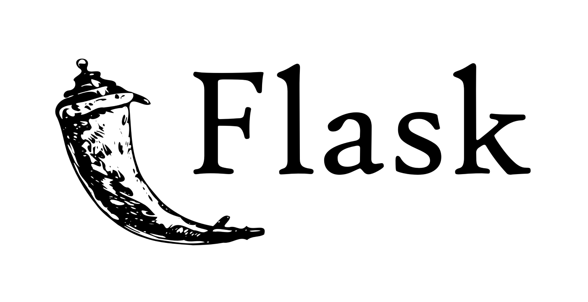
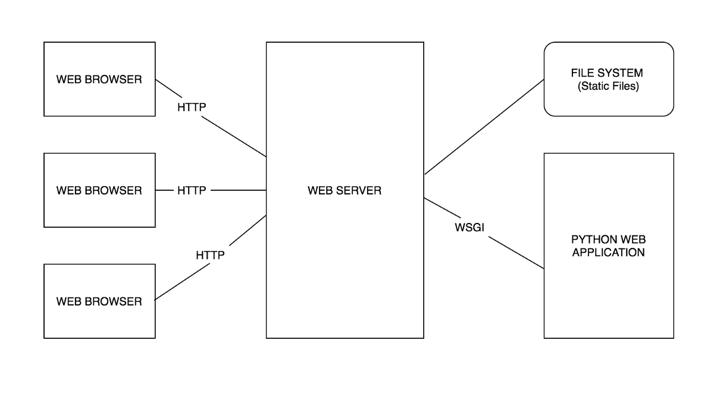

<div id="beginning"><h1>FLASK</h1></div>

<p align="center"></p>

<b><i>"Flask is a micro web framework written in Python. It is classified as a microframework because it does not require particular tools or libraries. It has no database abstraction layer, form validation, or any other components where pre-existing third-party libraries provide common functions. However, Flask supports extensions that can add application features as if they were implemented in Flask itself. Extensions exist for object-relational mappers, form validation, upload handling, various open authentication technologies and several common framework related tools."</b></i>

<hr>

<b>Table Of Contents</b> |
------------ | 
[Introduction - What is a Web Framework?](#web-framework)
[Introduction to Flask](#introduction-to-flask)
[WSGI](#wsgi)
[Jinja2](#jinja2)
[Werkzeug](#werkzeug)
[Installing and Setting Up Flask](#flask-installation-setup)
[Templates](#templates)
[Signals](#signals)
[Testing Flask Applications](#testing)
[Logging](#logging)
[Flask and Databases](#flask-databases)
[Flask Libraries](#flask-libs)
[References](#references)

<div id="web-framework"><h2>Introduction - What is a Web Framework?</h2>
<p>A web framework or <i>web application framework</i> is a software framework that is designed to support the development of web applications including web services, web resources and web APIs. In simple words, web frameworks are a piece of software that offers a way to create and run web applications.</p>

<h3>Types of Web Frameworks</h3>
<p>As web standards began to advance, the app logic shifted towards the client, ensuring smarter communication between the user and the web application. With logic on client-side, interface can react swiftly to user input. This makes web apps more responsive, easily navigate-able on any device. Thus, we have two functions of frameworks:
<ul>
    <li>The one to work on the server side, that helps to set up app logic on the server. <strong>(Backend)</strong></li>
    <li>To work on the client-side. <strong>(Frontend)</strong></li>
</ul></p>

<h4>Server-side(Backend) Frameworks</h4>
<p>The rules and architecture of the backend frameworks permit you to create simple pages, landings and forms of different kinds. To create a web application with a well-developed interface you need a wider range of functionality. Backend frameworks handle HTTP requests, database control and management, URL mapping, etc. These frameworks can improve security and form the output data — simplifying the development process. Some of the top backend frameworks are:
<ul>
    <li>NET (C#)</li>
    <li>Django (Python)</li>
    <li><strong>Flask (Python)</strong></li>
    <li>Ruby on Rails (Ruby)</li>
    <li>Express (JavaScript/Node.JS)</li>
</ul></p>

<h4>Client-side(Frontend) Frameworks</h4>
Frontend frameworks don’t take care of the business logic like the backend ones. They function inside the browser. Therefore, you can enhance and implement new user interfaces. A number of animated features can be created with frontend and single page applications. Every frontend framework varies in functionality and use.
<ul>
    <li>Angular</li>
    <li>Vue.JS</li>
    <li>React.JS</li>
</ul>

<p>Most of the web frameworks depend on the <strong>MVC (Model-View-Controller) architecture</strong>. The reason why this pattern is preferred lies in its rational design that separates the app logic from the interface and forms the three essential parts that are represented in the architecture’s name — MVC (Model-View-Controller).</p>

<p align="center"></p>

<h4>Model</h4>
<p>The Model is basically what lies inside the database. In structural databases it's the entity of a table. The model defines what data the app should contain. If the state of this data changes, then the model will usually notify the view (so the display can change as needed) and sometimes the controller (if different logic is needed to control the updated view).

In a shopping list app, the model would specify what data the list items should contain — item, price, etc. — and what list items are already present.</p>

<h4>View</h4>
<p>The View is for the graphical representation of the data like graph or charts etc. It is the apps’ front-end. It defines how the app's data should be displayed.

In a shopping list app, the view would define how the list is presented to the user, and receive the data to display from the model.</p>

<h4>Controller</h4>
<p>The controller contains logic that updates the model and/or view in response to input from the users of the app.

So for example, our shopping list could have input forms and buttons that allow us to add or delete items. These actions require the model to be updated, so the input is sent to the controller, which then manipulates the model as appropriate, which then sends updated data to the view.

You might however also want to just update the view to display the data in a different format, e.g., change the item order to alphabetical, or lowest to highest price. In this case the controller could handle this directly without needing to update the model.</p>

</div>


<div id="introduction-to-flask"><h2>Introduction to Flask</h2>
<p>Flask is a lightweight <a href="#wsgi">WSGI</a> web application framework. It is designed to make getting started quick and easy, with the ability to scale up to complex applications. It began as a simple wrapper around <a href="#werkzeug">Werkzeug</a> and <a href="#jinja">Jinja</a> and has become one of the most popular Python web application frameworks.

Flask offers suggestions, but doesn't enforce any dependencies or project layout. It is up to the developer to choose the tools and libraries they want to use. There are many extensions provided by the community that make adding new functionality easy.

<b>Features of Flask:</b>
<ul>
    <li>Integrated Unit testing support</li>
    <li>RESTful and HTTP request handling</li>
    <li>Easy and flexible configurations</li>
    <li>Gives the developer the full control of decisions to build the application during the development (implementation) stage</li>
    <li>Support for secure cookies (client-side sessions)</li>
    <li>Extensive documentation</li>
    <li>Comes with a built-in development server and fast debugger</li>
    <li>Flask has two main dependencies – Werkzeug and Jinja2 that provide strong WSGI support and templates, respectively.</li>
    <li>Easily deployable in production</li>
</ul>
</p>

</div>
<div id="wsgi">
    <h2>WSGI</h2>
    <p><strong>WSGI</strong> stands for "Web Server Gateway Interface". It is used to forward requests from a web server (such as Apache or NGINX) to a backend Python web application or framework. From there, responses are then passed back to the webserver to reply to the requestor. A WSGI server is necessary for Python web applications since a web server cannot communicate directly with Python. WSGI is an interface between a web server and a Python-based web application.</p>
    
    <p>Requests are sent from the client's browser to the server. WSGI forwards the request to the webserver python app, which then returns the completed request back to the webserver and on to the browser</p>
    <h3>Components</h3>
    <p>Most Python frameworks include a basic development server that can be used while building a web application. When you are ready to go live from a staging to a production environment, most deployments will utilize WSGI.</p>

There are two primary components of WSGI:
<ol>
    <li><strong>Server-side:</strong> The server-side element is going to invoke a callable object that is usually defined by a route.</li>
    <li><strong>Web-app or Framework:</strong> Once invoked, the web application or framework, contains the structure and the code that is to be executed.</li>
</ol>  

<p>In a framework such as Flask, routes are defined with a decorator. The Flask example below is what the callable object would look like for WSGI. When a request is made for this URI, the webserver passes this to WSGI which would then match the URI to a route defined in the application. The code related to that route is then executed.</p>

```py
# Route decorator used to define the callable object for WSGI
@app.route("/contact-us")
def contact_us():
    Return "How to contact us"
```
</div>

<div id="jinja2">
    <h2>Jinja2</h2>
    <p>Jinja2 is a full-featured template engine for Python. It is used to create HTML, XML or other markup formats that are returned to the user via an HTTP request. <strong>Jinja is Flask's default template engine.</strong>  It is inspired by Django's templating system but extends it with an expressive language that gives template authors a more powerful set of tools. Also, unlike the Django template engine, Jinja allows the template designer to call functions with arguments on objects. On top of that it adds sandboxed execution and optional automatic escaping for applications where security is important.</p>
<p>Jinja can be installed using pip:</p>

```sh
pip install jinja2
easy_install jinja2
```

<h3>Why do we need Jinja2?</h3>
<ol>
    <li><strong>Sandboxed Execution:</strong> It provides a protected framework for automation of testing programs, whose behavior is unknown and must be investigated.</li>
    <li><strong>HTML Escaping:</strong> Jinja 2 has a powerful automatic HTML Escaping, which helps preventing Cross-site Scripting (XSS Attack).</li>
    <li><strong>Template Inheritance:</strong> Jinja 2 supports Template Inheritance, which is one of the most powerful and useful features of any template engine. It means one template can inherit from another template.</li>
</ol>
<p>Servers used to have a collection of files, like HTML files, which were sent over as requested by clients. These were static data being sent over.

Now, in the modern web world, we have less of static data and more of dynamic data being requested from clients and therefore sent by the server. 

A template contains variables which are replaced by the values which are passed in when the template is rendered. Variables are helpful with the dynamic data.</p>

<!--
```
/app
   -/app.py
    /templates
       -/index.html
       -/404.html
```

<p>The structure of the application helps to keep the code organized and accessible. <strong>Flask expects the templates directory to be in the same folder as the module in which it was created.</strong> You can specify the location of the template_folder.</p>

```
app = Flask(__name__, template_folder='../pages/templates')
```
-->
<h3>Delimiters</h3>
<ul></ul>
    <li>  are for statements</li>
    <li> {{....}} are expressions used to print to template output</li>
    <li> {#....#} are for comments which are not included in the template output</li>
    <li> #....## are used as line statements</li>
</ul>

<p>Below is an example showing how to use expressions to show variables <i>title</i> and <i>username</i> in output.</p>

```html
<html>
    <head>
        <title>{{ title }}</title>
    </head>
    <body>
        <h1>Hello {{ username }}</h1>
    </body>
</html>
```

<a href="#templates">See more in templates</a>

</div>
<div id="werkzeug">
    <h2>Werkzeug</h2>
<p>Werkzeug is a collection of libraries that can be used to create a WSGI(Web Server Gateway Interface) compatible web application in Python

Werkzeug provides the following functionality (<i>which Flask uses)</i>:</p>
<ol>
    <li>Request processing</li>
    <li>Response handling</li>
    <li>URL Routing</li>
    <li>Middleware</li>
    <li>HTTP utilities</li>
    <li>Exception handling</li>
</ol>

<p>It also provides a basic development server with hot reloading.</p>

<a href="Werkzeug/README.md">See more in the Werkzeug README</a>

</div>
<div id="flask-installation-setup">
    <h2>Installing and Setting Up Flask</h2>

Installing the `Flask` dependency should be enough to be able to use it in the project.


Let's create our tutorial project in a new directory called `flask-tutorial` and install dependencies(Flask) in a virtual environment. 

```sh
$ mkdir flask-tutorial
$ cd flask-tutorial
$ python3 -m venv venv
$ venv\Scripts\Activate
$ pip install Flask
```

A `Flask` app can be as simple as a single file, such like:

```py
from flask import Flask

app = Flask(__name__)

@app.route('/')
def hello():
    return 'Hello, World!'
```

</div>

<div id="templates">
    <h2>Templates</h2>
</div>
<div id="signals">
    <h2>Signals</h2>
</div>
<div id="testing">
    <h2>Testing Flask Applications</h2>
</div>
<div id="logging">
    <h2>Logging</h2>
</div>
<div id="flask-databases">
    <h2>Flask and Databases</h2>
</div>
<div id="flask-libs">
    <h2>Flask Libraries</h2>
    <a href="">Flask-SQLAlchemy</a>
    <a href="">Flask-WTF</a>
    <a href="">Flask-Bootstrap</a>
    <a href="">Flask-Mail</a>
    <a href="">Flask-Migrates</a>
    <a href="">Flask-Uploads</a>
    <a href="">Flask-Login</a>
    <a href="">Flask-Babel</a>
    <a href="">Flask-User</a>
    <a href="">Flask-Restless</a>
    <a href="">Flask-SocketIO</a>
    <a href="">Flask-Security</a>
</div>

---
<div id = "references">
<h3>References</h3>

[Official Flask Documentation](https://flask.palletsprojects.com/)

[]()

[]()

</div>

<a href="#beginning">Go to the beginning of the page</a>
