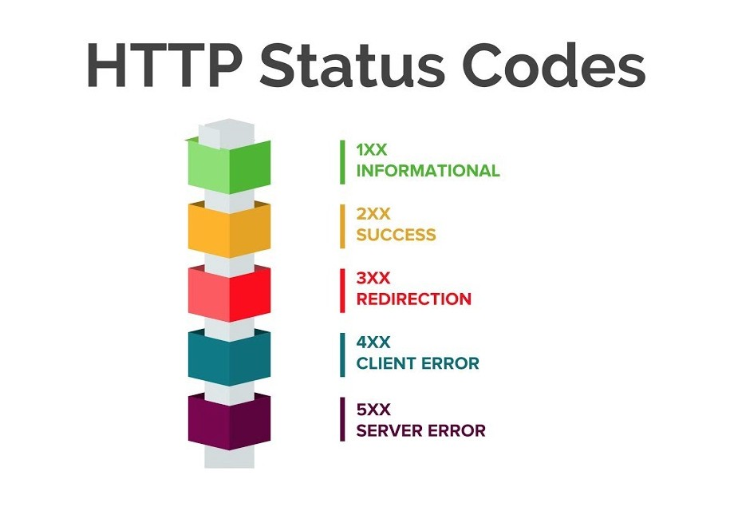

# REST


<b>Table Of Contents</b> |
------------ | 
[Introduction - What is an API?](#api)
[REST Architecture](#rest-arch)
[REST APIs and Web Services](#rest-http)
[REST and Python — Requests Library](#rest-python-requests)
[REST and Python — Building APIs](#rest-python-building-apis)
[REST and Python — Tools and Frameworks](#rest-python-tools-frameworks)
[Building REST APIs using Flask and Python](#apis-using-flask-and-python)

<div id="api">
<h2>Introduction - What is an API?</h2>
<p>The term API stands for "Application Programming Interface". Imagine a do-it-yourself restaurant, where you can prepare your own dish and the ingredients are provided to you if you wish. You can also bring your own ingredients in and ask them for a ready dish! The menu of ingredients in this restaurant would be the API. When you specify what menu items you want, the restaurant's freezer has them ready for you and if the item you ask for is a ready dish, you don't know exactly how the restaurant prepares it, and you don't really need to.</p>

<p>Similarly, an API lists a bunch of operations that developers can use, along with a documentation(description) of their purpose. The developers just need to know that it is available for use in their app. They can provide own data to the API to get the results. </p>

<p>APIs make life easier for developers by providing reusable and distributable code. For example, if you are willing to make an app for iOS where you'd process the image taken by the iPhone's camera, you don't have to write your own camera interface. Instead, you can use the camera API to embed the iPhone's built-in camera in your app. If APIs didn’t exist to make this easy, app developers would have to create their own camera software and interpret the camera hardware’s inputs. But Apple’s operating system developers have done all this hard work so the developers can just use the camera API to embed a camera, and then get on with building their app. And, when Apple improves the camera API, all the apps that rely on it will take advantage of that improvement automatically. </p>

<p>This applies to every platform. For example, do you want to create a dialog box on Windows? There’s an API for that. Want to support fingerprint authentication on Android? There’s an API for that, too, so you don’t have to test every different Android manufacturer’s fingerprint sensor. Developers don’t have to reinvent the wheel over and over.</p>

<p><strong>In short, the API mediates between applications via requests and responses.</strong> For instance, registration in the application through the user's existing Twitter account occurs through the Twitter API that developers have integrated into the app.</p>


The API uses various protocols and architectures for sending requests and responses:
<ul>
<li> <strong>XML-RPC</strong> — allows the exchange of functions between networks. XML-RPC uses XML to describe responses/requests and HTTP protocols for information transferring from client to server.</li>
<li><strong>JSON-RPC</strong> is a lightweight RPC similar to XML. Here protocol is encoded in JSON; it allows receiving calls to the server with asynchronous responses.</li>
<li><strong>SOAP</strong> — a simple object access protocol for exchanging structured information when implementing web services in computer networks. SOAP uses XML for authentication, authorization, and process communication on operating systems. It allows clients to call web services and receive responses regardless of platform and language.</li>
<li><strong>REST API (representative state transfer)</strong> — an architectural style using client-server implementations independently. REST uses HTTP protocol for communication.</li>
</ul>
</div>

<div id="rest-arch">
<h2>REST Architecture</h2>
<strong>REST</strong> stands for <strong>re</strong>presentational <strong>s</strong>tate <strong>t</strong>ransfer and is a software architecture style that defines a pattern for client and server communications over a network. REST provides a set of constraints for software architecture to promote performance, scalability, simplicity and reliability in the system.

REST defines the following architectural constraints:
<ul>
    <li><strong>Stateless:</strong>The server won't maintain any state between requests from the client and won't contain any data about the client. All information needed for request processing is included in the request. The client stores all session information.</li>
    <li><strong>Client-server:</strong> The REST API implements a client-server architecture style. 
    <ul>
    <li>The client is sending requests for resources and is not associated with the data storage.</li>
    <li>Data storage remains inside the server.</li>
    <li>Servers are not involved in the communication with the user interface.</li>
    <li>The client and server evolve interdependently.</li></ul> This factor makes the REST even more flexible and scalable.</li>
    <li><strong>Cacheable:</strong> The data retrieved from the server should be cacheable either by the client or by the server. If the data is cacheable, then in similar requests, the client can use the same data without repeatedly sending requests to the server. It helps improve performance and availability.</li>
<li><strong>Uniform interface:</strong> The unified interface is an essential factor distinguishing the REST API. It states that there is a single way for communicating with the server, not implying the type of application and device.
    <ul>
    <li><i>Identification of resources.</i> Each resource must have an identification that is independent of the resource's state. The <strong>URL</strong> acts as an identifier.</li>
    <li><i>Manipulation of resources through representations.</i> A resource representation (that client has) contains the data required to delete or modify the resource. The client sends a representation (a JSON object) that the server needs to modify, remove, or add.</li>
    <li><i>Self descriptive messages.</i> Each message has enough information for the server to parse the request. No additional information is required in separate documentation or messages.</li>
    <li><i>Hypermedia as the engine of application state.</i> Hypermedia requires links usage for each response so that the client can find other resources. In REST, hypermedia is used for all interactions.</li>
    </ul>
</li>
<li><strong>Layered system:</strong> The client may access the resources on the server indirectly through other layers such as a proxy or load balancer.</li>
<li><strong>Code on demand(optional):</strong> The server may transfer code to the client that it can download and run.</li>
</ul>
<strong>REST is not a specification but a set of guidelines on how to architect a network-connected software system.</strong>
</div>

<div id="rest-http">
<h2>REST APIs and Web Services</h2>


<p>A REST web service is any web service that adheres to REST architecture constraints. These web services expose their data to the outside world through an API. REST APIs provide access to web service data through public web URLs.</p>

For example, here's one of the URLs for GitHub's REST API:

```html
https://api.github.com/users/<username>
https://api.github.com/users/AxoyTO
```
This URL allows to access information about a specific GH user. We access data from a REST API by sending HTTP request to a specific url and processing the response.

<h3>HTTP Requests</h3>
<p>REST API communicates through HTTP requests. A <strong>resource</strong> is any data available in the web service that can be accessed and manipulated with <strong>HTTP</strong> requests to the REST API. The HTTP method tells the API which action to perform on the resource.</p>

<center></center>

<h3>Status Codes</h3>
<p>Once a REST API receives and processes an HTTP request, it will return an HTTP response. Included in this response is an HTTP status code. This code provides information about the results of the request. An application sending requests to the API can check the status code and perform actions based on the result. These actions could include handling errors or displaying a success message to a user.</p>
<center></center>

Most common status codes returned by REST APIs:
<table>
    <tr>
        <th>Code</th>
        <th>Meaning</th>
        <th>Description</th>
    </tr>
    <tr>
        <td>200</td>
        <td>OK</td>
        <td>The requested action was successful.</td>
    </tr>
    <tr>
        <td>201</td>
        <td>Created</td>
        <td>A new resource was created.</td>
        </tr>
    <tr>
        <td>202</td>
        <td>Accepted</td>
        <td>The request was received, but no modification has been made yet.</td>
    </tr>
    <tr>
        <td>204</td>
        <td>No Content</td>
        <td>The request was successful, but the response has no content.</td>
    </tr>
    <tr>
        <td>400</td>
        <td>Bad Request</td>
        <td>The request was malformed.</td>
    </tr>
    <tr>
        <td>401</td>
        <td>Unauthorized</td>
        <td>The client is not authorized to perform the requested action.</td>
    </tr>
    <tr>
        <td>404</td>
        <td>Not Found</td>
        <td>The requested resource was not found.</td>
    </tr>
    <tr>
        <td>415</td>
        <td>Unsupported Media Type</td>
        <td>The request data format is not supported by the server.</td>
    </tr>
    <tr>
        <td>422</td>
        <td>Unprocessable Entity</td>
        <td>The request data was properly formatted but contained invalid or missing data.</td>
    </tr>
    <tr>
        <td>500</td>
        <td>Internal Server Error</td>
        <td>The server threw an error when processing the request.</td>
    </tr>
    
</table>
</div>

<div id="rest-python-requests">
<h2>REST and Python — Requests Library</h2>

<center></center>
The <strong>requests</strong> library abstracts away the complexities of making HTTP requests.

To start using <strong>requests</strong>, we need to install it first. We can use python package installer(pip) to install it:
```sh
python -m pip install requests
```
<h3>GET</h3>
<strong>GET</strong> is one of the most common HTTP methods we'll use when working with REST APIs. <strong>GET</strong> allows us to retrieve resources from a given API. <strong>GET</strong> is a <strong>read-only</strong> operation.

```py
import requests
api_url = "https://api.coingecko.com/api/v3/simple/price?ids=bitcoin&vs_currencies=usd&include_24hr_change=true"
response = requests.get(api_url)
print(response.ok) # True
print(response.status_code) # 200
print(response.request) # <PreparedRequest [GET]>
print(response.url) # 'https://api.coingecko.com/api/v3/simple/price?ids=bitcoin&vs_currencies=usd&include_24hr_change=true'
print(response.json()) 
# {'bitcoin': {'usd': 20094, 'usd_24h_change': -2.7382059716452076}}
```

<h3>POST</h3>
CoinGecko doesn't have a free POST API. Thus, we'll use a service called JSONPlaceholder, which provides fake API endpoints that send back responses that <strong>requests</strong> can process. Here's the data we'll send:

```json
{
    "userId": 1,
    "title": "Buy milk",
    "completed": false
}
```

This JSON contains information for a new <u>todo</u> item. We run the following code to create a <u>todo</u>:

```py
import requests
api_url = "https://jsonplaceholder.typicode.com/todos"
todo = {"userId": 1, "title": "Buy milk", "completed": False}
response = requests.post(api_url, json=todo)
print(response.json()) # {'userId': 1, 'title': 'Buy milk', 'completed': False, 'id': 201}
print(response.status_code) # 201
```
Unless we want simplicity, we can do this in a more complex way without using the <i>json</i> keyword. We would've needed to set <i>Content Type</i> accordingly and serialize the JSON manually with the help of JSON library.
```py
import requests, json
api_url = "https://jsonplaceholder.typicode.com/todos"
todo = {"userId": 1, "title": "Buy milk", "completed": False}
headers = {"Content Type":"application/json"}
response = requests.post(api_url, data=json.dumps(todo), headers=headers)
print(response.json()) 
# {'userId': 1, 'title': 'Buy milk', 'completed': False, 'id': 201}
print(response.status_code) # 201
```
The <i>headers</i> dictionary that contains a single header <i>Content-Type</i> set to <>application/json</i> tells the REST API that we're sending JSON data with the POST request.

<h3>PUT</h3>
Beyond <strong>GET</strong> and <strong>POST</strong>, requests provides support for all the other HTTP methods we would use with a REST API. The following code sends a PUT request to update an existing <u>todo</u> with new data. Any data sent with a <strong>PUT</strong> request will completely replace the existing values of the <u>todo</u>.

```py
import requests
api_url = "https://jsonplaceholder.typicode.com/todos/10"
response = requests.get(api_url)
print(response.json())
# {'userId': 1, 'id': 10, 'title': 'illo est ... aut', 'completed': True}

todo = {"userId": 1, "title": "Wash car", "completed": True}
response = requests.put(api_url, json=todo)
print(response.json())
# {'userId': 1, 'title': 'Wash car', 'completed': True, 'id': 10}

print(response.status_code) # 200
```
Note that successful <strong>PUT</strong> requests will always return 200 instead of 201 because we aren't creating a new resource but just updating an existing one.

<h2>PATCH</h2>
We will use <strong>PATCH</strong> to modify the value of a specific field on an existing <u>todo</u>. <strong>PATCH</strong> differs from <strong>PUT</strong> in that it doesn’t completely replace the existing resource. It only modifies the values set in the JSON sent with the request.

```py
import requests
api_url = "https://jsonplaceholder.typicode.com/todos/10"
todo = {"title": "Study for the exams"}
response = requests.patch(api_url, json=todo)
print(response.json())
# {'userId': 1, 'id': 10, 'title': 'Mow lawn', 'completed': True}

print(response.status_code) # 200
```

<h2>DELETE</h2>
If we want to completely remove a resource, then we use DELETE. Here’s the code to remove a <u>todo</u>:

```py
import requests
api_url = "https://jsonplaceholder.typicode.com/todos/10"
response = requests.delete(api_url)
print(response.json()) # {}
print(response.status_code) # 200
```
The API URL contains the id of the <u>todo</u> we would like to remove. This sends a <strong>DELETE</strong> request to the REST API, which then removes the matching(by id) resource.


</div>

<div id="rest-python-building-apis">
<h2>REST and Python — Building APIs</h2>
</div>

<div id="rest-python-tools-frameworks">
<h2>REST and Python — Tools and Frameworks</h2>
</div>

<div id="apis-using-flask-and-python">
<h2>Building REST APIs using Flask and Python</h2>
</div>

---

## References:

[RealPython](https://realpython.com/api-integration-in-python/#rest-architecture)
[AppMaster](https://appmaster.io/blog/what-rest-api-and-how-it-differs-other-types)
[Towards Data Science](https://towardsdatascience.com/creating-restful-apis-using-flask-and-python-655bad51b24)
[HowToGeek](https://www.howtogeek.com/343877/what-is-an-api/)
